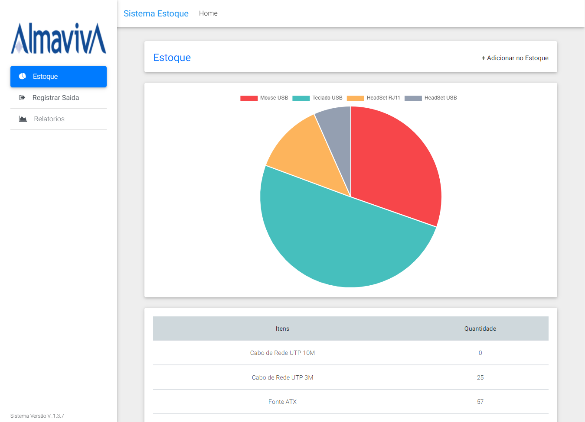

# Sistema-Estoque

### Sistema simples de controle de Estoque em PHP+JS+SQL+BS.

>index.php


Pode ser totalmente modificado conforme sua necessidade.

Os produtos do banco de dados podem ser alterados conforme o ramo da empresa.

Arquivo `'BancoEstoque.sql'` para importar os dados do Banco.

Arquivo `'conecta.php'` para modificar os acessos ao BD.

```bash
$conexao = mysqli_connect('localhost', 'root', '', 'sistemaestoque');
```

Arquivo `'banco-produto.php'` contem todas as funcões que inserem e buscam informações no BD, deve ser modificado de acordo com suas tabelas do BD.
```bash
function insereProduto($conexao, $nome, $motivo, $chamado, $local, $solicitante, $tecnico, $data, $quantidader) {
    $query = "insert into relatorio (item, motivo, chamado, local, solicitante, tecnico, dataregistro, quantidade)
```

# Screenshots

>estoque.php


>relatorio.php


>Modal para Registrar Saida dos Itens. Pode ser aberto em qualquer Aba do sistema. 

